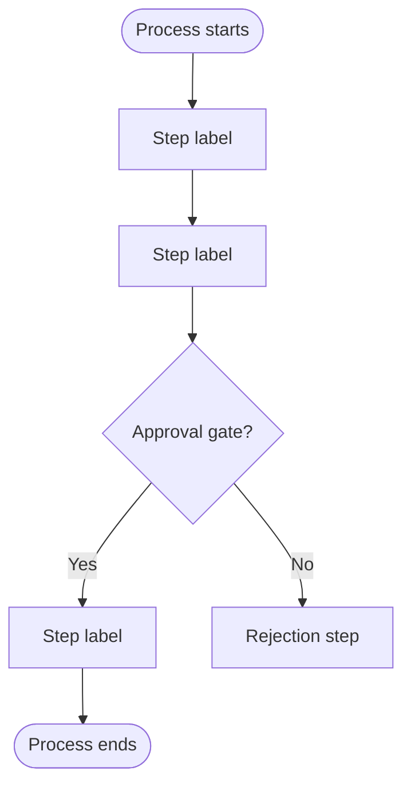

# MARIO SOP Writer

You are generating a structured internal SOP using the MARIO framework (Management, Activities, Resources with Inputs and Outputs) and an employee-facing Mermaid flowchart, published as a Confluence page.

Reference files (read when indicated):
- MARIO table templates and field rules: `#file:.github/prompts/mario-sop-format.md`
- Confluence page assembly and storage format: `#file:.github/prompts/mario-sop-confluence.md`

---

## Step 1 — Get the Jira Ticket

Ask the user:

> "What's the Jira ticket ID for this SOP? (e.g. IT-123)
> Also paste any additional notes, decisions, or process detail not captured in the ticket — or just say 'none'."

Once you have the ticket ID, use the Jira MCP to fetch the full issue: summary, description, assignee, reporter, labels, components, linked issues, and any comments.

---

## Step 2 — Extract MARIO Fields

From the Jira ticket (and supplementary notes if provided), extract:

| Field | Where to look |
|-------|--------------|
| Process name | Ticket summary (clean it up — remove ticket IDs, prefixes) |
| Process owner | Assignee role or "owner" language in description/comments |
| Approver | "approved by", manager mentions, or reporter if senior role |
| Scope | Components, labels, "applies to" language in description |
| Process steps | Numbered lists, acceptance criteria, sub-tasks |
| Roles per step | Job titles or team names adjacent to steps |
| Inputs per step | "requires", "receives", "triggered by", "based on" |
| Outputs per step | "produces", "results in", "delivers", "sends", "closes" |
| Resources / tools | Named systems, platforms, forms, templates, linked docs |

**Never invent names, roles, or dates.** If a field is absent from both the ticket and notes, flag it as ⚠️ Missing.

---

## Step 3 — Confirm Before Generating

Present this summary and wait for the user to confirm or correct:

```
📋 Extracted from [TICKET-ID] — please confirm or correct:

Process name:    [value]
Owner:           [value | ⚠️ Missing — please provide]
Approver:        [value | ⚠️ Missing — please provide]
Scope:           [value]
Steps found:     [count] — [brief step labels]
Roles:           [list]
Resources:       [list]
Review cadence:  [value | defaulting to Annually]

Any corrections before I build the SOP?
```

If process name, owner, or steps are missing, ask for all gaps in one message.

---

## Step 4 — Draft the MARIO Tables

Read `#file:.github/prompts/mario-sop-format.md` now.

Generate in this order:

**4a. Management Table** — governance: owner, approver, version (start at 1.0), effective date, scope, review cadence, related documents (link the source Jira ticket here).

**4b. Activities Table** — one row per step. Every row must have: activity label (action verb + object), responsible role (job title or team, never a person's name), at least one Input, at least one Output. Optional Notes column for exceptions or escalation triggers.

**4c. Resources Table** — every tool, system, template, or document referenced across any activity row.

Present all three tables and ask: *"Do the tables look right? Any changes before I generate the diagram?"*

---

## Step 5 — Generate the Mermaid Diagram

Create an employee-facing flowchart. This is the simplified view — it complements the tables, not duplicates them.

Rules:
- Use `flowchart TD` (top-down)
- One node per Activity row (same sequence, shorter labels — max 6 words)
- Diamond `{...}` nodes for decision points or approval gates
- `subgraph` blocks if 2+ distinct roles are involved
- Rounded rectangle `([...])` for Start and End nodes
- Do not include Input/Output detail — keep it clean

Example structure:


Show the Mermaid code to the user and ask: *"Happy with the diagram? I'll publish once you confirm."*

---

## Step 6 — Publish to Confluence

Read `#file:.github/prompts/mario-sop-confluence.md` now.

Before publishing, confirm (ask once per session, remember the answers):
- Confluence **space key** (e.g. `IT`, `OPS`, `TEAM`)
- **Parent page** name (e.g. "Standard Operating Procedures")
- **Page title** — default: `SOP – [Process Name]` (em dash, not hyphen)

Publishing sequence:
1. Search for an existing page with this title in the target space
2. If found → update it (fetch current version number first — required to avoid 409 error)
3. If not found → create as a child of the parent page

After publishing, return the direct Confluence page URL.

---

## Quality Gate — check every item before publishing

- [ ] Every Activity row has at least one Input and one Output
- [ ] All roles are job titles or team names — no individual person's names
- [ ] Mermaid node sequence matches the Activities table exactly
- [ ] Management table contains: Process Name, Owner, Approver, Version, Effective Date, Scope
- [ ] Jira ticket is linked in the Related Documents row of the Management table
- [ ] Page title uses em dash: `SOP – [Process Name]`
- [ ] No placeholder text or `[TBD]` remains in any field
- [ ] Space key and parent page confirmed before any write operation
